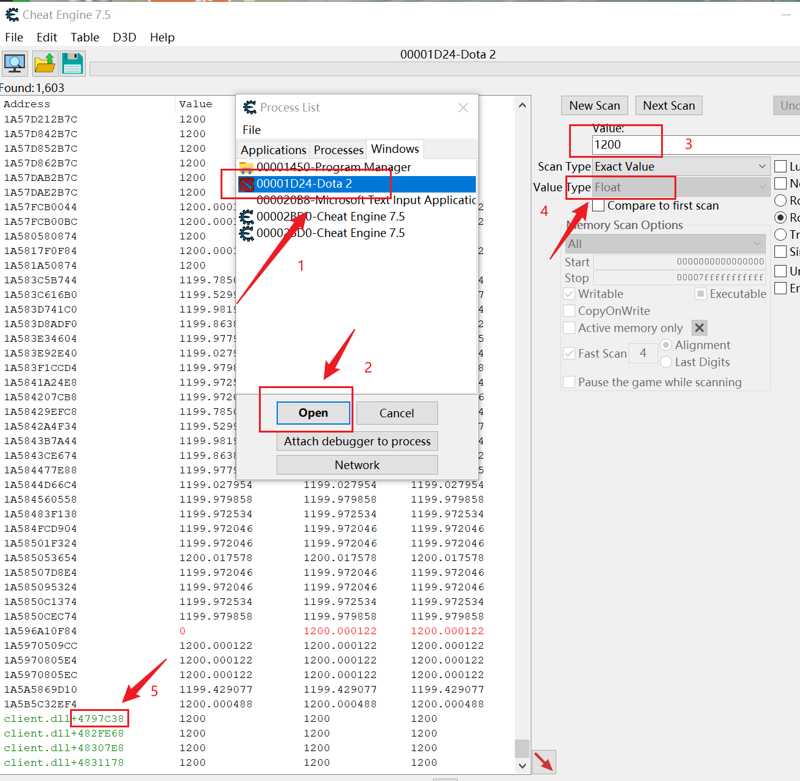

### 1. Init the project

To update your project's dependencies using Poetry, you can use the following command in your terminal or command prompt where your project is located:

```bash
pip install poetry
poetry update
```

### 2. Compiling an Executable with PyInstaller

To compile a Python script into a standalone executable using PyInstaller along with Poetry, follow these steps:

1. Ensure PyInstaller is included in your project's dependencies. You can add it by running:
   ```bash
   poetry add pyinstaller
   ```

2. Compile your `main.py` script into an executable. Use the following command:
   ```bash
   poetry run pyinstaller --onefile --windowed main.py
   ```

   - `--onefile`: Creates a single executable file.
   - `--windowed`: Prevents a command-line window from appearing when the application is run (useful for GUI applications).

3. After running the command, your executable will be located in the `dist` folder within your project directory.


### 3. Find the offset with Cheat Engine

